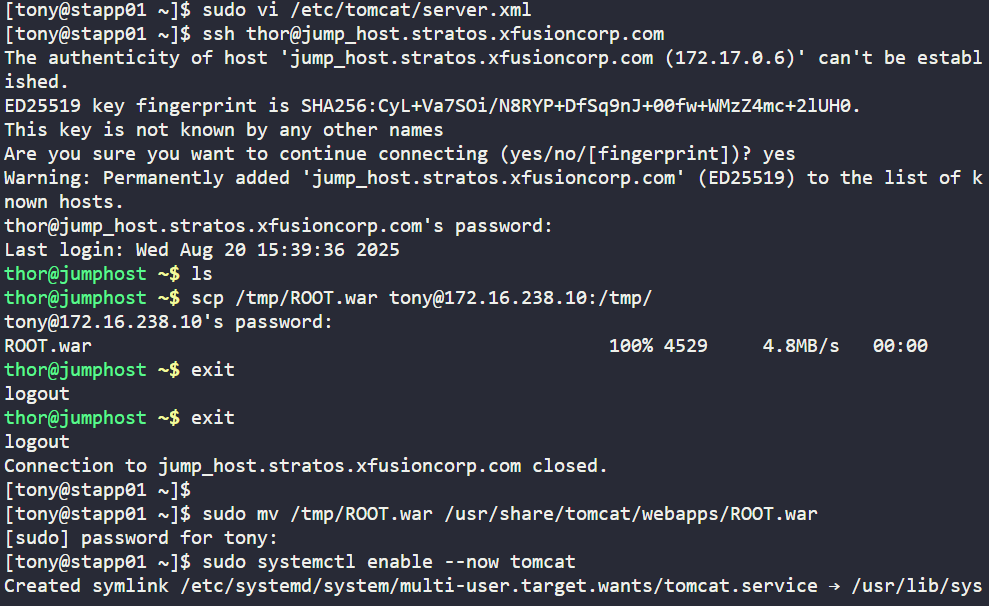

The Nautilus application development team recently finished the beta version of one of their Java-based applications, which they are planning to deploy on one of the app servers in Stratos DC. After an internal team meeting, they have decided to use the tomcat application server. Based on the requirements mentioned below complete the task:

a. Install tomcat server on App Server 1.

b. Configure it to run on port 5003.

c. There is a ROOT.war file on Jump host at location /tmp.

Deploy it on this tomcat server and make sure the webpage works directly on base URL i.e curl http://stapp01:5003
### Install Tomcat

sudo dnf install -y tomcat tomcat-webapps tomcat-admin-webapps

### Change port to 5003

sudo vi /etc/tomcat/server.xml

Find: <Connector port="8080" protocol="HTTP/1.1" 

Change to: <Connector port="5003" protocol="HTTP/1.1" 

### Deploy ROOT.war
Copy from Jump host:

scp /tmp/ROOT.war tony@stapp01:/tmp/
sudo mv /tmp/ROOT.war /usr/share/tomcat/webapps/ROOT.war

### Enable & start Tomcat

sudo systemctl enable --now tomcat

### Verify

curl http://stapp01:5003

